# Model Training Pipeline - Architecture Diagram

## End-to-End Flow

```mermaid
graph TB
    Start[Developer makes changes] --> Branch[Create feature branch]
    Branch --> Commit[Commit changes]
    Commit --> PR[Create Pull Request]
    
    PR --> Validation{PR Validation}
    Validation -->|✅ Pass| Approved[Team approves PR]
    Validation -->|❌ Fail| FixIssues[Fix issues]
    FixIssues --> Commit
    
    Approved --> Merge[Merge to main]
    Merge --> DevDeploy[Deploy to DEV - AUTOMATIC]
    
    DevDeploy --> DevTests{DEV Smoke Tests}
    DevTests -->|✅ Pass| DevSuccess[DEV Success]
    DevTests -->|❌ Fail| DevFix[Fix issues in new PR]
    DevFix --> PR
    
    DevSuccess --> ManualTest[Manual testing in DEV]
    ManualTest --> TestTrigger{Ready for TEST?}
    TestTrigger -->|Yes| TestApproval[Trigger TEST deployment]
    TestTrigger -->|No| DevFix
    
    TestApproval --> TestDeploy[Deploy to TEST - MANUAL]
    TestDeploy --> TestValidation{TEST Validation}
    TestValidation -->|✅ Integration Tests Pass| TestSuccess[TEST Success]
    TestValidation -->|❌ Fail| DevFix
    
    TestSuccess --> ProdTrigger{Ready for PROD?}
    ProdTrigger -->|Yes + Change Ticket| ProdApproval[Trigger PROD deployment]
    ProdTrigger -->|No| TestSuccess
    
    ProdApproval --> Backup[Create PROD Backup]
    Backup --> ProdDeploy[Deploy to PROD - MANUAL]
    ProdDeploy --> ProdValidation{PROD Validation}
    ProdValidation -->|✅ Pass| ProdSuccess[PROD Success]
    ProdValidation -->|❌ Fail| Rollback[Automatic Rollback]
    Rollback --> DevFix
    
    ProdSuccess --> Audit[Log to audit trail]
    Audit --> Notify[Notify stakeholders]
    Notify --> End[Deployment Complete]
    
    style DevDeploy fill:#90EE90
    style TestDeploy fill:#FFD700
    style ProdDeploy fill:#FF6347
    style Backup fill:#1E90FF
    style Rollback fill:#FF0000
    style End fill:#32CD32
```

## Job Dependencies

## Environment Progression

```mermaid
graph LR
    DEV[🔧 DEV<br/>Automatic<br/>No approval] --> TEST[🧪 TEST<br/>Manual trigger<br/>1 reviewer]
    TEST --> PROD[🎯 PROD<br/>Manual trigger<br/>2 reviewers<br/>Change ticket<br/>Backup created]
    
    style DEV fill:#90EE90,stroke:#2E8B57,stroke-width:3px
    style TEST fill:#FFD700,stroke:#DAA520,stroke-width:3px
    style PROD fill:#FF6347,stroke:#DC143C,stroke-width:3px
```

## Deployment Decision Tree

## Artifact Deployment Flow

## Trigger Types

## Security & Approval Gates

```mermaid
graph TD
    Code[Code Changes] --> Gate1{Security Scan}
    Gate1 -->|✅ Pass| Gate2{Unit Tests}
    Gate1 -->|❌ Fail| Block1[Block merge]
    
    Gate2 -->|✅ Pass| Gate3{Code Review}
    Gate2 -->|❌ Fail| Block1
    
    Gate3 -->|✅ Approved| DEV[Deploy to DEV]
    Gate3 -->|❌ Changes requested| Block1
    
    DEV --> Gate4{DEV Smoke Tests}
    Gate4 -->|✅ Pass| Manual1{Manual Approval<br/>for TEST?}
    Gate4 -->|❌ Fail| Block2[Stay in DEV]
    
    Manual1 -->|✅ Approved| TEST[Deploy to TEST]
    Manual1 -->|❌ Denied| Block2
    
    TEST --> Gate5{Integration Tests}
    Gate5 -->|✅ Pass| Manual2{Manual Approval<br/>for PROD?}
    Gate5 -->|❌ Fail| Block3[Stay in TEST]
    
    Manual2 -->|✅ Approved + Ticket| Backup[Create Backup]
    Manual2 -->|❌ Denied| Block3
    
    Backup --> PROD[Deploy to PROD]
    PROD --> Gate6{PROD Validation}
    Gate6 -->|✅ Pass| Success[✅ Success]
    Gate6 -->|❌ Fail| Rollback[🔙 Rollback]
    
    style Gate1 fill:#FFE4B5
    style Gate2 fill:#FFE4B5
    style Gate3 fill:#FFE4B5
    style Gate4 fill:#90EE90
    style Gate5 fill:#FFD700
    style Gate6 fill:#FF6347
    style Backup fill:#1E90FF
    style Success fill:#32CD32
    style Rollback fill:#FF0000
```

